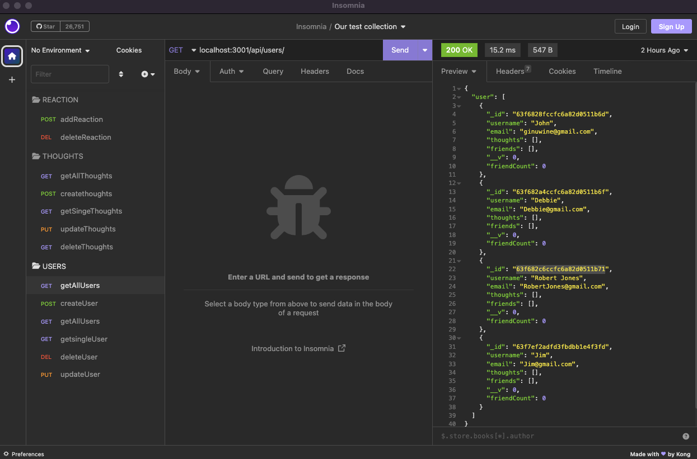
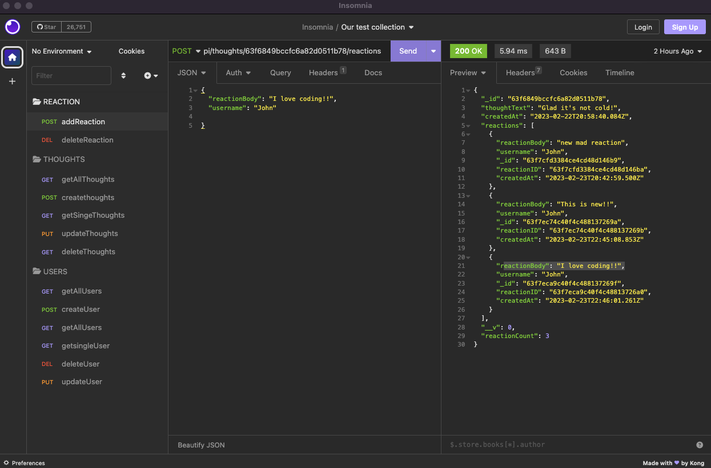
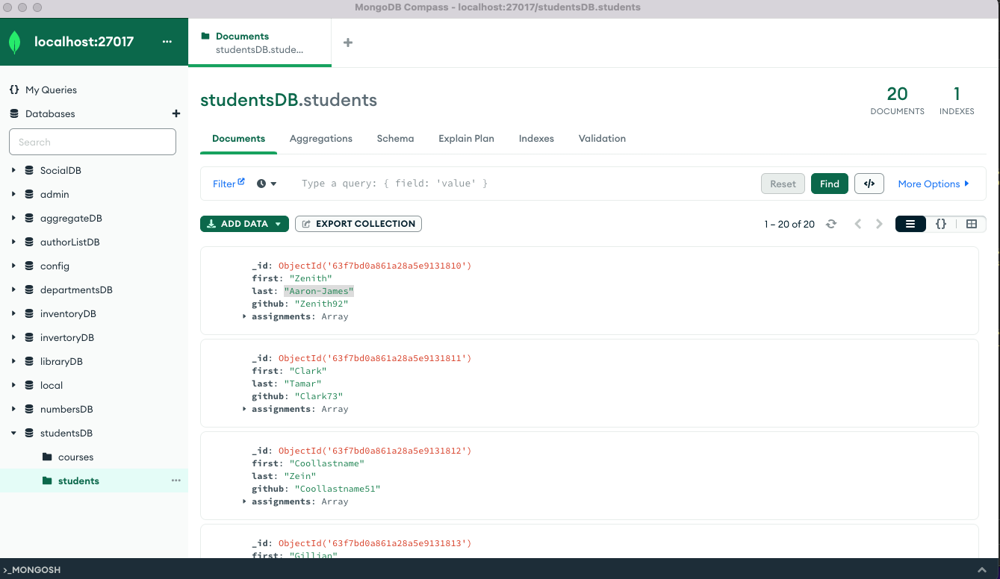

<h1 align="center">The Inventory</h1>

  

Media Wiz

 

## Table of Contents 

- [Installation](#installation)
- [Usage](#usage)
- [Credits](#credits)
- [License](#license)

 

## Description
 **Hello👋**

-  The Inventory is built from a API for a social network web application where users can share their thoughts, react to friends’ thoughts, and create a friend list. 
- Because the foundation of these applications is data, it’s important that you understand how to build and structure the API first. 
- Because this application won’t be deployed, I've create a walkthrough video that demonstrates its functionality and all functionality is being met. There is a link to a walkthrough video that's added to the README .

## <h2 id="installation"> Installation </h2>

1. Install Insomnia 
2. Install MongoDB Compass

 

## <h2 id="usage"> Usage </h2>

🔭  Navigate to the VS Code.

👨‍💻  Here you will terminal and install Node, Express, Mongoose. 

🤝  RUN server.js.

📫  **YOUR IN!** In Insomnia run localhost path.

👯  Refresh MongoDB database. That's it

ScreenShots 🏆

 

🔭 [Deployment Video](https://drive.google.com/file/d/1tfy9g1DGI9eUbnjihZgitYW4bga30lvB/view) 🔭

 

<h2>Languages Used/Requirements</h2>

  

               

- JavaScript
- MongoDB
- Node.js 
- Express.js 
- RESTful API
- NoSQL

- [x] Reliable API // This is done 
- [x] Authentication // This is done
 

 
<h2 id="credits">Collaborators/Creditors 🏆</h2>

👨‍💻 We are Coding BootCamp Alumni of [UCF](https://www.ucf.edu/students/) ⭐️

- [Profile]( https://github.com/JonJon50  " John Hagens ") -- John Hagens

Contributions, issues, and feature requests are welcome! 🤝

<table>
	<tr>
		<td>
			Don't forget to star ⭐ this repository
		</td>
	</tr>

 

<h2 id="license">MIT License</h2>
The MIT License (MIT)

Copyright (c) <year> Adam Veldhousen

Permission is hereby granted, free of charge, to any person obtaining a copy
of this software and associated documentation files (the "Software"), to deal
in the Software without restriction, including without limitation the rights
to use, copy, modify, merge, publish, distribute, sublicense, and/or sell
copies of the Software, and to permit persons to whom the Software is
furnished to do so, subject to the following conditions:

The above copyright notice and this permission notice shall be included in
all copies or substantial portions of the Software.

THE SOFTWARE IS PROVIDED "AS IS", WITHOUT WARRANTY OF ANY KIND, EXPRESS OR
IMPLIED, INCLUDING BUT NOT LIMITED TO THE WARRANTIES OF MERCHANTABILITY,
FITNESS FOR A PARTICULAR PURPOSE AND NONINFRINGEMENT. IN NO EVENT SHALL THE
AUTHORS OR COPYRIGHT HOLDERS BE LIABLE FOR ANY CLAIM, DAMAGES OR OTHER
LIABILITY, WHETHER IN AN ACTION OF CONTRACT, TORT OR OTHERWISE, ARISING FROM,
OUT OF OR IN CONNECTION WITH THE SOFTWARE OR THE USE OR OTHER DEALINGS IN
THE SOFTWARE.
@Levi0100
</h5>